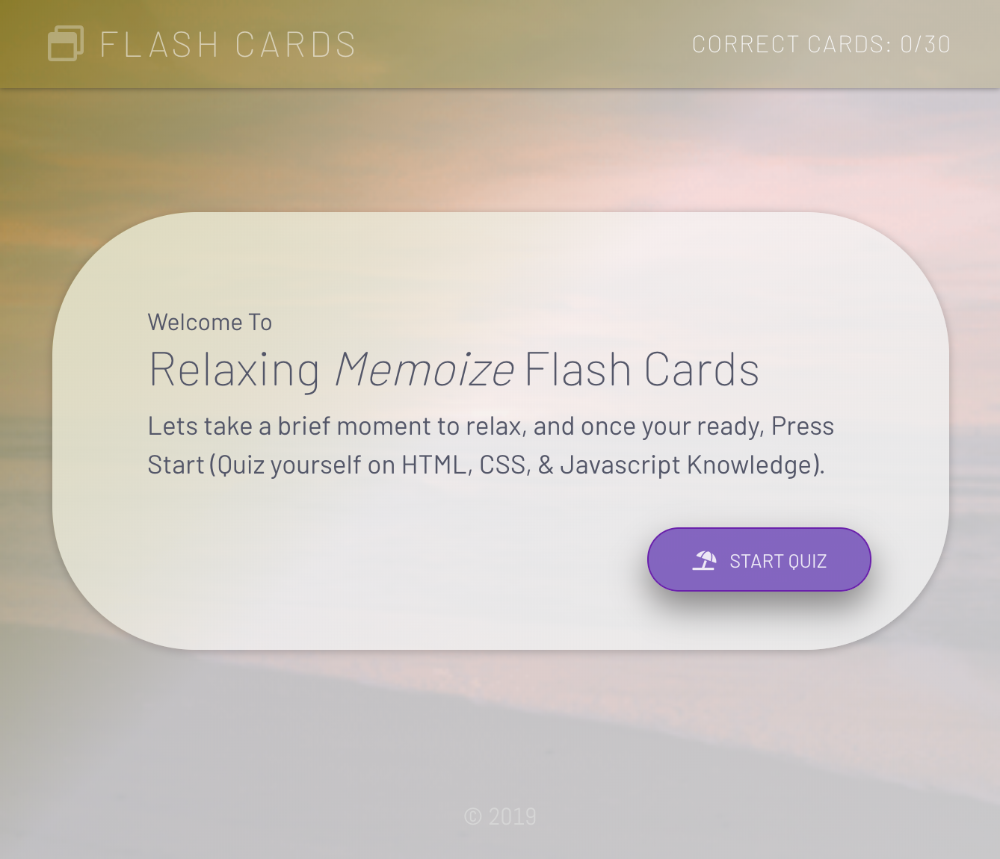

# Flash Cards Memoize

### Project Description

Flash Cards Memoize is an app for aspiring developers to use in order to practice some basic Javascript, HTMl and CSS questions. The user is first brought to a start page where they can click and are given 30 questions. As the user gets questions right they will be shown their score increasing at the top of the screen. As they click each question the next question will show, once they answer all 30 questions the quiz will end. At the end of the quiz they are given the option to start the game over again if they would want. Another feature of this application is if a user answers questions and gets some right without finishing the quiz they can refresh the page and their answers will be stored, as well as any wrong answers left to ask.

### Screen Shots

### Setup

- <code>git clone</code> https://github.com/MRKrog/FlashCards.git
- <code>npm install</code> from the project directory

### Built With

- HTML, CSS / SCSS, JavasSript
- React
- Jest / Enzyme
- Local Storage

### Contributors
- Michael Krog

### Original Assignment
<a href=http://frontend.turing.io/projects/memoize.html>Memoize</a> project from <a href="https://turing.io/">Turing School of Software and Design</a>, Mod 2
